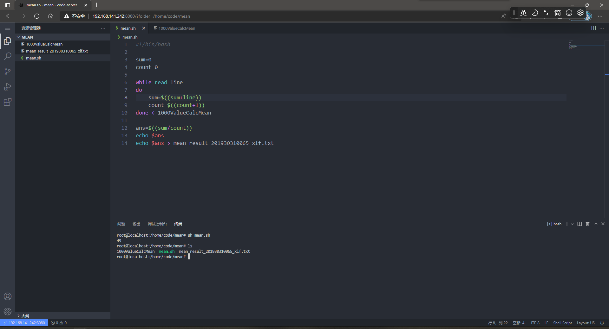

# Bash Script

Edit a bash script file(.sh) using vim calculates the average of a data set in the file.

Edited by Adlexer Xu 201930310065

## Steps

### 1.Create the bash shell file(.sh)

Use `vim` to edit the name `mean.sh`. If this file does not exist, it will be created automatically.

```bash
$ vim mean.sh
```

Optional: You can use `code-server` to remotely edit and build your code.

Because I'm lazy, I'll do all the operations later through `code-server`. Therefore, the operations related to `vim` will no longer be described.

### 2.Edit this script

```bash
#!/bin/bash

sum=0
count=0

while read line
do
    sum=$((sum+line))
    count=$((count+1))
done < 1000ValueCalcMean

ans=$((sum/count))
echo $ans
echo $ans > mean_result_201930310065_xlf.txt
```

This while-do-done structure will read the data line by line in the file(1000ValueCalcMean). This file contains 1000 lines of data. 

In `bash` command line, it's usually an operation on a string or a command, so if you try to reference a variable in its name, you need to put an operator `$` next to it to reference its data.

This operator `$(())` refers to an expression in double brackets. And these `<` and `>` are the file-redirection operators.

### 3.Execute this script on command line

```bash
$ sh mean.sh
```

And then, you will see the output and a file generated by redirection output.

```bash
$ sh mean.sh
49
$
```

```bash
$ ls
1000ValueCalcMean  mean.sh  mean_result_201930310065_xlf.txt
$
```

**Code-server sample, running on Windows browser:**



All the above files can be found in this branch.

