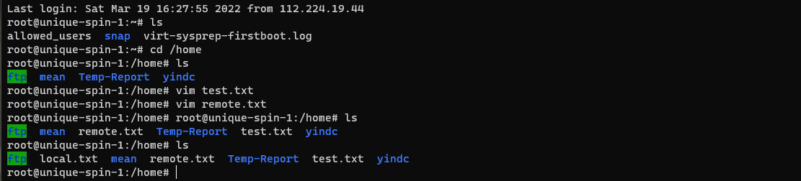

# File Transfer

Installing and configuring the Ubuntu common remote file transfer server and client.

Editing by Adlexer Xu 201930310065

## SCP

`scp` is the remote file transfer command of `Ubuntu`.

### Using

#### 1.将本机文件复制到远程服务器上

```bash
# scp local_path_to_file user@192.168.0.1:remote_path
```

* `local_path_to_file` the local path to file you want to transfer
* `user` user on remote server such  as `root`
* `192.168.0.1`  IP address of remote server
* `remote_path` the path of remote server you want to place the file in

#### 2.将远程服务器上的文件复制到本机

```bash
# scp user@192.168.0.1:remote_path_to_file local_path 
```

### Test

The test environment is `Ubuntu bash` command line on `Windows cmd` , which is logged in remotely via `SSH`, and local Ubuntu logged in using Android phone. Remote Ubuntu has create test file named `remote.txt` and local Ubuntu has create test file named `local.txt`.

#### 1.Login remote Ubuntu(Windows)

```powershell
>ssh -p 27503 root@144.34.167.6
```

#### 

#### 2.Copy file from remote server(Android)

```bash
# scp -P 27503 local.txt root@114.34.167.6:/home
```

#### 3.Copy file to remote server(Android)

```bash
# scp -P 27503 root@114.34.167.6:/home/remote.txt /root
```

#### 4.Result

**local command line:**


**local:**


**remote:**



## NFS

NFS 即网络文件系统（Network File-System），可以通过网络让不同机器、不同系统之间可以实现文件共享。通过 NFS，可以访问远程共享目录，就像访问本地磁盘一样。NFS 只是一种文件系统，本身并没有传输功能，是基于 RPC（远程过程调用）协议实现的，采用 C/S 架构。

### Steps

#### 1.Login remote Ubuntu(Windows)

```powershell
>ssh -p 27503 root@144.34.167.6
```

#### 2.Install NFS packages

```bash
# apt install nfs-kernel-server
# apt install nfs-common
```

#### 3.Add NFS shared directories

```bash
# vim /etc/exports
```

Setting `/home/nfsroot` as NFS shared directory.

Making new folder on this path.

```bash
# mkdir /home/nfsroot
```

#### 4.Start NFS service

```bash
# /etc/init.d/nfs-kernel-server start
```

or

```bash
# /etc/init.d/nfs-kernal-server restart
```

if you changed the file `/etc/exports`

#### 5.Test

Adding test file and mounting remote NFS shared directory on local Ubuntu.

## TFTP


